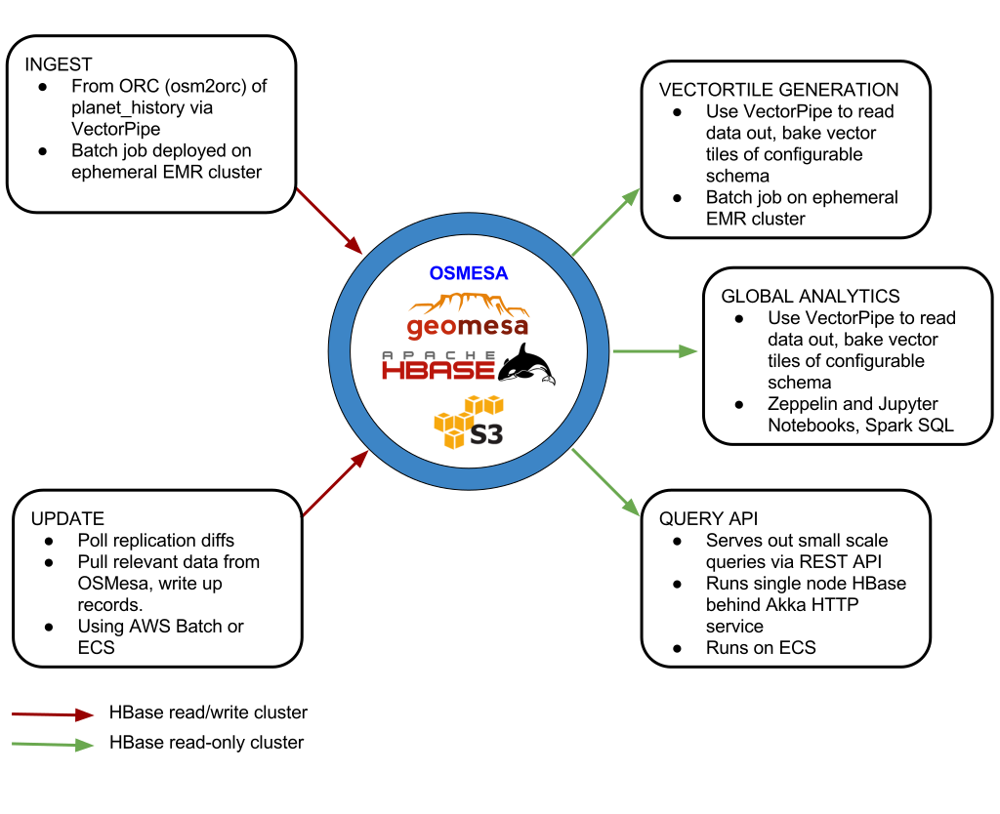

## OSMesa

[](https://gitter.im/osmesa/Lobby?utm_source=badge&utm_medium=badge&utm_campaign=pr-badge&utm_content=badge)

This project is a stack for working with Open Street Map (OSM) and other vector data sources in GeoMesa. It is build to allow for large scale batch analytic jobs to run on the latest OSM data, updated with minutely replication files.
__NOTE__ This repo is pre-alpha and under active development. Contact the authors if you are interested in helping out or using this project.

## Components



### OSMesa Store

The center of it all is a GeoMesa-enabled instance of HBase, backed by the Amazon S3 object store, that will store all Open Street Map and other

### Ingest

Use [osm2orc](https://github.com/mojodna/osm2orc) to convert `pbf` files to `ORC` files.

Use osmesa-ingest to ingest ORC file into the GeoMesa instance.
The GeoMesa instance will be based on HBase, with it's storage on S3.
VectorPipe will be used to generate the feature data from OSM elements.
The ingest will be run as a Spark job.

The ingest will create the following key/value tables:

node-id -> metadata
node-id -> way-id
node-id -> relation-id
way-id -> metadata
relation-id -> metadata
changeset-id -> metadata
way-id -> geometry
relation-id -> geometry

### Update

There is a polling service that watches for diffs and updates the GeoMesa instance accordingly.
This service will also be able to throw augmented diffs on a queue for consumption by [planet-stream](https://github.com/developmentseed/planet-stream).

### Query API

This service will be an akka-http service running on an instance with an HBase read-only master, which
can be used to query the GeoMesa instance on S3. This will only be able to queries of a size that will
be based on the resources available to this instance or cluster.

### Global Analytics

Spark batch jobs will be able to run on ephemeral clusters for analytics, either scheduled or ad-hoc.

GeoMesa SparkSQL will also be available for analytics.

### VectorTile Generation

VectorPipe will be able to transform an RDD of Features that is pulled out of GeoMesa into Vector Tiles
with an appropriate schema.

## Development

### Requirements

* Vagrant 1.8+
* VirtualBox 4.3
* Ansible 2.1+

### Getting Started

Install the application and all required dependencies.

```sh
./scripts/setup.sh
```

Rebuild Docker images and run application.

```sh
vagrant up
vagrant ssh
./scripts/update.sh
./scripts/server.sh
```

### Ports

| Service            | Port                            |
| ------------------ | ------------------------------- |
| __TODO__           | [`4567`](http://localhost:4567) |

### Testing

```
./scripts/test.sh
```

### Scripts

| Name           | Description                                                   |
| -------------- | ------------------------------------------------------------- |
| `cibuild.sh`   | Build project for CI                                          |
| `clean.sh`     | Free disk space by cleaning up dangling Docker images         |
| `console.sh`   | Run interactive shell inside application container            |
| `lint.sh`      | Lint source code                                              |
| `server.sh`    | Run Docker Compose services                                   |
| `setup.sh`     | Provision Vagrant VM and run `update.sh`                      |
| `test.sh`      | Run unit tests                                                |
| `update.sh`    | Build Docker images                                           |

### Docker

Here is a list of useful commands that you can run inside the VM.

- `docker images` will show you a list of all your VM's installed images
- `docker rmi <IMAGE-NAME>` will delete the specified image
- `docker run -it usace-program-analysis-react /bin/sh` will log you into the `usace-program-analysis-react` image's shell
- `docker-compose up` will build and start containers according to the instructions in `docker-compose.yml` file
- `docker-compose ps` will show you a list of running containers
- `docker-compose down` will halt these running containers
- `docker-compose build` will rebuild all containers listed in the `docker-compose.yml` file
- `docker-compose build react` will rebuild only the react container per instructions listed in `docker-compose.yml`
- `docker-compose exec <SERVICE> /bin/sh` where `<SERVICE>` is a service name specified in `docker-compose.yml` will open a shell to a currently running container.

See the
[docker](https://docs.docker.com/engine/reference/commandline/) and
[docker-compose](https://docs.docker.com/compose/reference/overview/)
 command line reference guides for more information.


### TODO

Development setup that allows you to:
- Create a local ingest of OSMFeature and Geometry features out of ORC into GeoMesa
- Use GeoServer to view results
- Dockerized setup of all components
- Terraform-based deployment scripts for running setup in AWS
