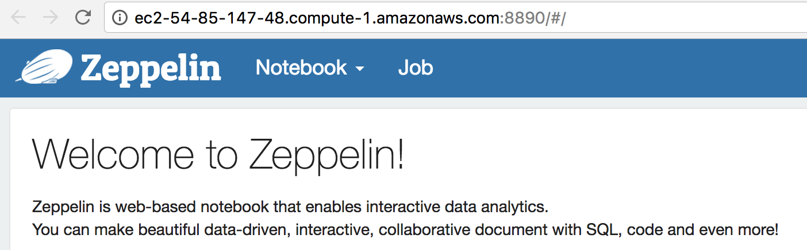
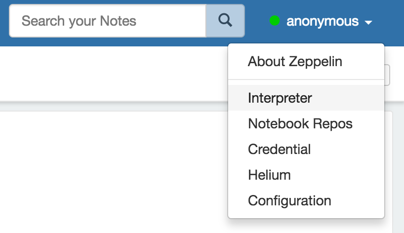
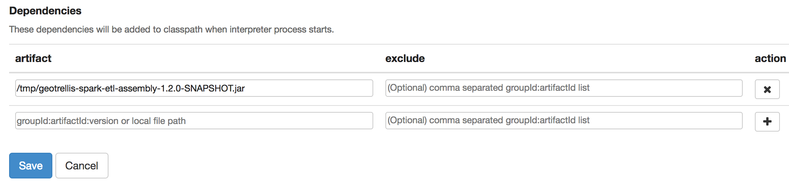
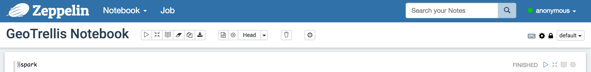
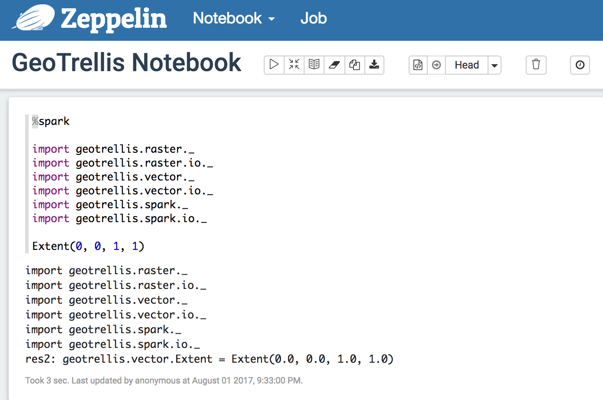
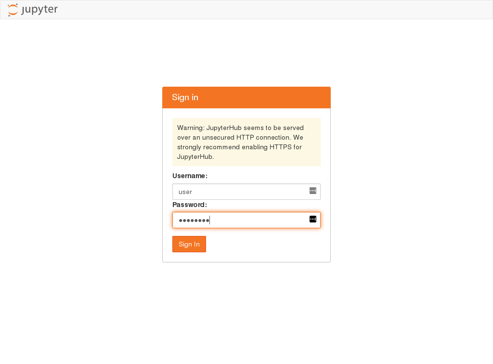
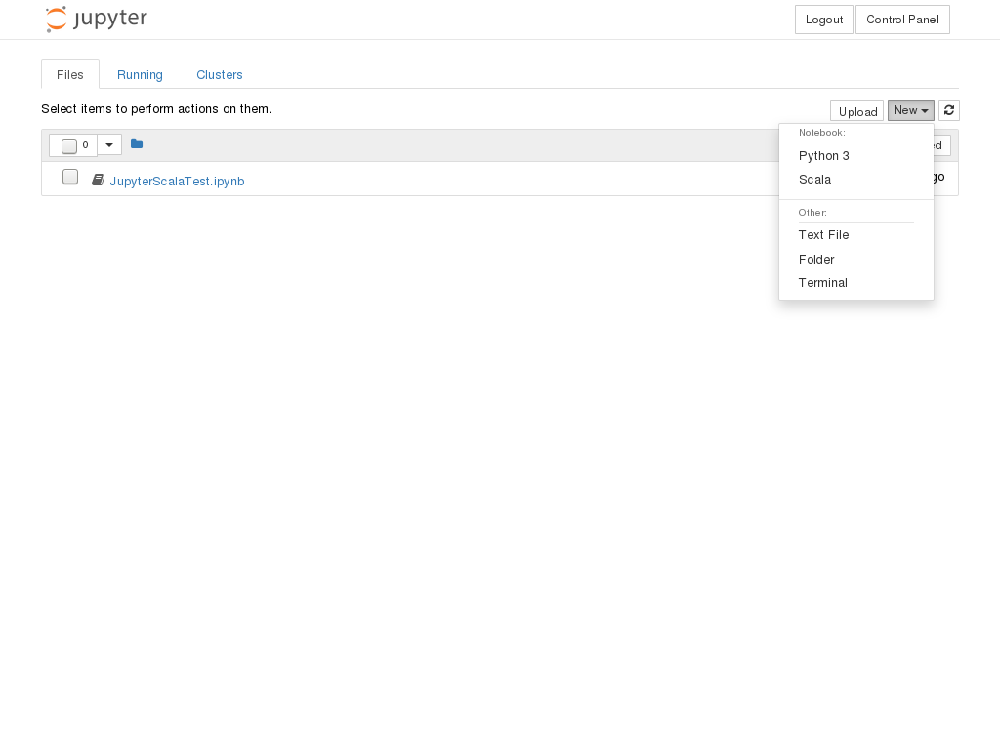
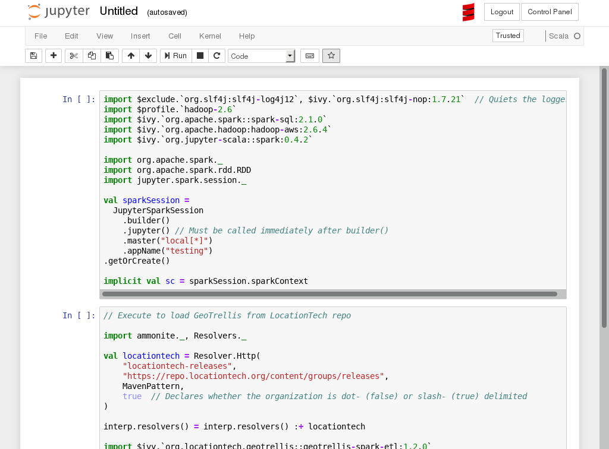

# GeoTrellis EMR

This directory contains a make file to spin up an EMR cluster using [terraform](https://github.com/hashicorp/terraform).

- [Requirements](#requirements)
- [Makefile](#makefile)
- [Running](#running)

## Requirements

[Terraform 0.11.5](https://github.com/hashicorp/terraform/releases/tag/v0.11.5)

## Settings

[cluster/variables.tf](cluster/variables.tf) contains the full set of variables
which can be specified to modify an EMR deployment. Only those not
provided defaults need to be specified, and these can be found within
[tfvars.tpl](tfvars.tpl) - be sure to make a copy of this template and remove
'tpl' from the filename.


## Makefile

| Command               | Description
|-----------------------|------------------------------------------------------------|
|auth.json              |Generate temporary session and key/secret                   |
|validate-cluster       |`terraform validate - Validate terraform                    |
|init-cluster           |`terraform init` - Initialize terraform                     |
|cluster-tfplan         |`terraform plan` - Plan out an 'apply'  of this terraform   |
|cluster                |`terraform` init, if it's the first run                     |
|ssh                    |SSH into a running EMR cluster                              |
|destroy-cluster        |Destroy a running EMR cluster                               |
|print-vars             |Print out env vars for diagnostic and debug purposes        |


## Running

The Makefile in this directory provides commands to easily set up an EMR
cluster with MFA, but doing so does require a minimal amount of configuration.
It will be necessary to export your desired AWS profile as well as
having set up `assume role` permissions and an MFA device for the AWS
profile exported. You'll also need to make a copy of tfvars.tpl for
adding parameters specific to your deployment.

```bash
export AWS_PROFILE=my_profile
cp tfvars.tpl tfvars
# update tfvars with values appropriate to the EMR cluster you'd like
make auth.json
make cluster
```

`make auth.json` will prompt you for your MFA key and produce a
session which terraform can use to get around MFA restrictions.

**Note:** long startup times (10 minutes or more) probably indicates that you have
chosen a spot price that is too low.

This basic cluster will have a running Zeppelin interface that can be accessed
via SSH tunnel with
[foxyproxy](https://docs.aws.amazon.com/emr/latest/ManagementGuide/emr-connect-master-node-proxy.html)



This cluster will not have access to any code until we upload the
appropriate jars and register them within zeppelin

```bash
make upload-assembly
```

is issued.  Upon doing so, you must configure Zeppelin to recognize this
resource by going to the interpreters tab:



Edit the spark interpreter settings by adding the GeoTrellis jar into the
class path (`make upload-assembly` copies the fat jar into, e.g.,
`/tmp/geotrellis-spark-etl-assembly-1.2.0-SNAPSHOT.jar`):



You may then create a new notebook:



wherein GeoTrellis deps can be imported:



### Creating a Jupyter Scala cluster

An alternative to Zeppelin that may be more user-friendly will be to create a
cluster with Jupyter notebook installed.  To do so, set
`TF_VAR_s3_notebook_bucket` and `TF_VAR_s3_notebook_prefix` to appropriate
values (for example, `geotrellis-work` and `user/notebooks`, respectively).
This will set a location on S3 for persistent storage of notebooks.  Then
issue

```bash
make terraform-init &&\
make create-jupyter-cluster
```

**Note:** long startup times (10 minutes or more) probably indicates that you have
chosen a spot price that is too low.  Set `TF_VAR_spot_price` appropriately.

After completing the startup process, navigate to port 8000 of the new
cluster.  You will be greeted with a login prompt.  Log in as `user` with the
password `password`:



You will then be presented with the file browser where you may open existing
notebooks, or create new ones.  To create a new notebook, in the `New`
dropdown in the upper right, choose `Scala`:



**Note:** Python 3 is available as an option, but it will not have
GeoTrellis/Spark capabilities.

In the resulting notebook, you may enter Scala code, but neither GeoTrellis
nor a SparkContext are yet available.  As this notebook interface is based on
Ammonite, there is no `build.sbt` to set up imports, and you must use the
Ammonite import syntax.  To ease initial setup, an extension was provided to
load in the standard boilerplate code for setting up Spark and GeoTrellis.
Click the star icon in the toolbar to insert three new cells at the top of
your notebook:



The first cell can be executed as is, which could take a few minutes to
download the required packages.  This will create the `implicit val sc:
SparkContext` required by many GeoTrellis operations.

To import GeoTrellis, choose **one** of the following two cells to execute.
Either execute the code to load a published version of GeoTrellis from the
LocationTech repo, _or_ execute the cell to load the `spark-etl` fat jar made
available on the cluster using the `make upload-assembly` directive on your
local machine.

After this, it will be possible to import and use GeoTrellis code.  Notebooks
saved during this session will persist in the given S3 directory.
